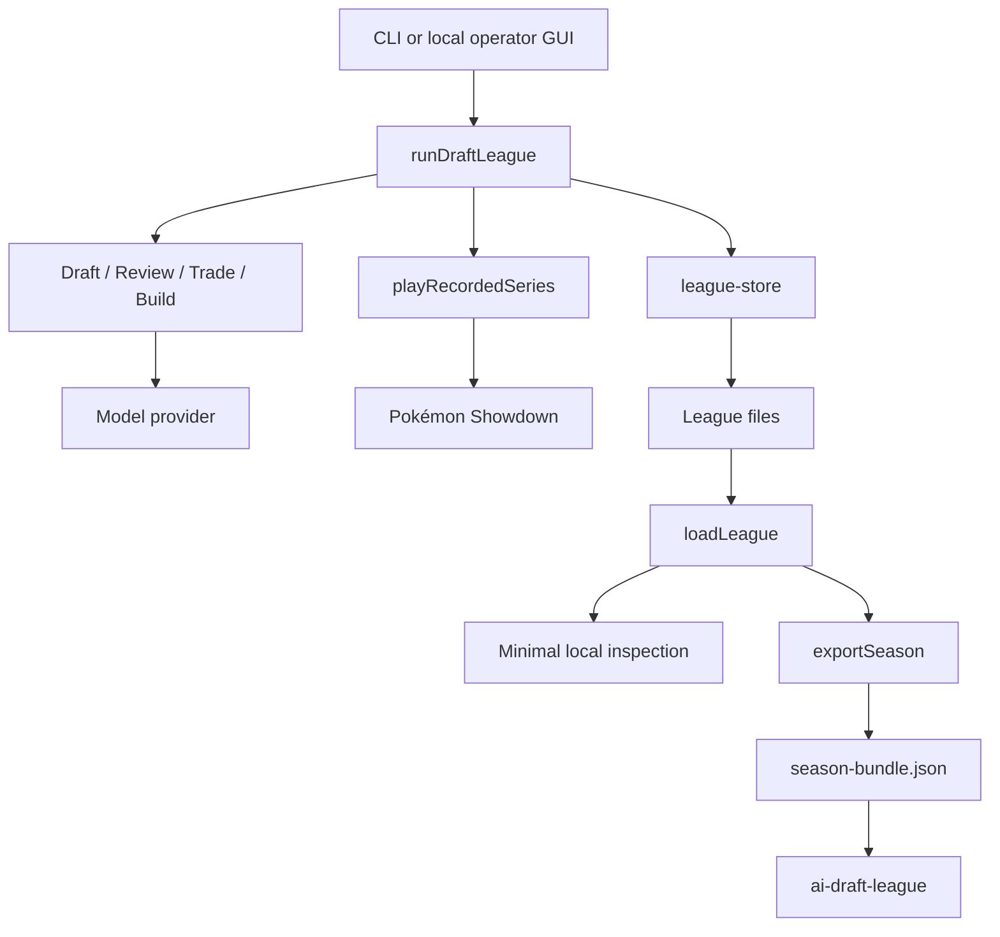

# Architecture

## Ownership

`runDraftLeague` owns phase order and carries one user cancellation signal through the run. It does not define a generic stage framework and no model-facing manager schedules other agents.

`league-store` owns `config.json`, completed-stage reads and writes, and resume checks. Persisted identity is limited to the facts needed to understand or continue a season: models and seating, seed, board and format, Showdown revision, timer and sheet policy, schedule and transaction options, and provider specifications when present.

Draft, weekly review, transaction, teambuild, battle, and season-review functions consume explicit state and return stage results. They do not create independent compatibility protocols. Completed series carry entrant identity directly. Completed game logs have one canonical board-ID summary for brought Pokémon, Mega Evolution, and faints.

`playRecordedSeries` owns a best-of-three against the pinned simulator. Pokémon Showdown is the authority for team legality, accepted actions, randomness, battle transitions, timers, and results. League code enforces only rules outside Showdown, such as draft ownership, budgets, roster size, and Mega locks.

The local GUI is an operator surface: launch or cancel a run, inspect active battles, errors, and raw artifacts, and export a season. Polished league browsing belongs only to `ai-draft-league`. The spectator reads the committed `season-bundle.json`; it does not import harness code or recompute rules, standings, legality, or outcomes.

## Trust and security boundaries

- `showdown.lock.json` pins the official Pokémon Showdown repository to a full commit. Setup verifies the installation before the harness runs.
- The GUI binds to loopback. Remote exposure requires an operator-controlled local proxy.
- Provider API keys remain in process memory and are never written to run files, logs, records, or the public bundle.
- Run and series identifiers are validated before filesystem access; callers cannot escape configured data roots.
- Decisions, game evidence, and completion records are append-only. Completion markers are the resume boundary for finished games and stages.
- User cancellation is the run-level abort mechanism. Provider adapters own external-call timeouts and error classification. The optional Showdown timer owns gameplay deadlines.
- The exporter is the only publication boundary. It validates the projected bundle before writing it. Unreleased weeks, future playoff rounds, private memory, prompts, provider responses, traces, credentials, and closed sets before their reveal point do not enter the bundle.
