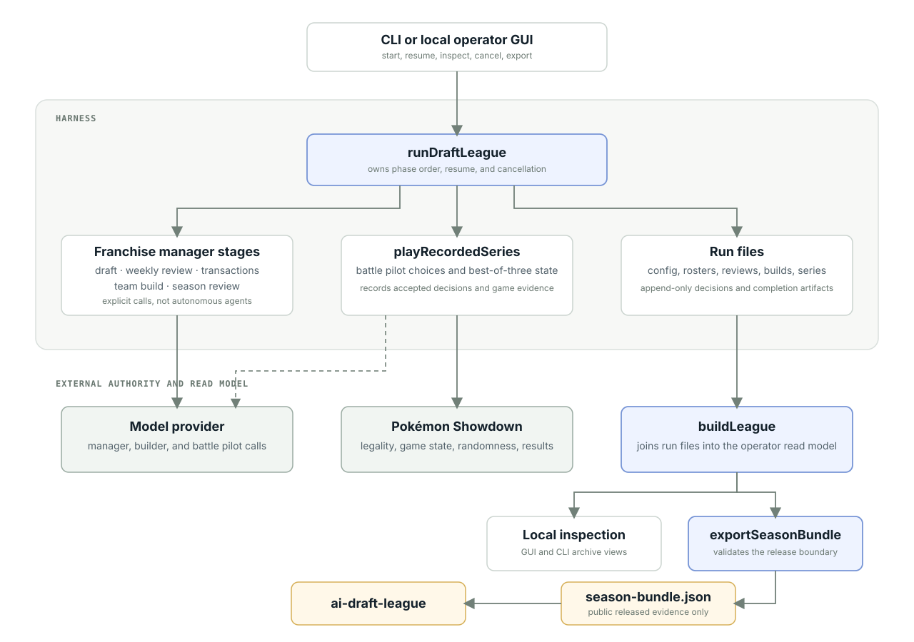

# Architecture

VGC Model League separates season orchestration, model calls, battle simulation, persistence, and publication. This page shows which component owns each job and how data crosses those boundaries.

<figure class="doc-diagram">
  
  <figcaption>The run directory connects season execution, local inspection, and public export. The model provider and Pokémon Showdown remain external to the harness.</figcaption>
</figure>

For the state supplied to each model call, see [How franchise managers work](manager-model.md).

## What runDraftLeague owns

`runDraftLeague` owns phase order and carries one user cancellation signal through the whole run. It is not a generic stage framework, and no model-facing manager schedules other agents. Every stage below it is an ordinary function call.

Stage functions for draft, weekly review, transactions, teambuild, battle, and
season review consume explicit state and return their results. They do not
invent compatibility protocols between each other. Completed series carry
entrant identity directly, and every completed game log holds one canonical
board-ID summary of brought Pokémon, Mega Evolution, and faints.

## Where state lives

The run directory is the database. `config.json` records the season facts
needed to understand or resume a run: models and seating, seed, board and
format, Showdown revision, timer and sheet policy, schedule and transaction
options, and provider specifications when present.

Decisions, game evidence, and completion records are append-only. Completion markers are the resume boundary for finished games and stages. Resume reads the files in order and continues from the last complete marker. Private memory pages, prompts, and provider traffic leave the run directory only through the exporter.

## Battles

`playRecordedSeries` owns a best-of-three against the pinned simulator.
Pokémon Showdown is the authority for team legality, accepted actions,
randomness, battle transitions, timers, and results. League code enforces only
what Showdown cannot see: draft ownership, budgets, roster size, and Mega
locks.

The pin lives in `showdown.lock.json`, which names a full official commit. Setup verifies the installation before any run starts.

## Run files and local reads

`buildLeague` joins completed run files and series records into the read model used by local inspection and export. `league-store` separately reads the saved state that `runDraftLeague` needs for resume.

The local GUI is a workspace for launching or cancelling a run, inspecting active battles and errors, and reading raw artifacts. It binds to loopback. Remote access requires an operator-controlled proxy.

Public league browsing belongs to [AI Draft League](https://github.com/jrhuc/ai-draft-league), which reads only the exported bundle.

## Publication boundary

The exporter is the only path from a run directory to the public. `exportSeasonBundle` uses `buildLeague`, checks the explicit release boundary, validates the projection, and writes `season-bundle.json`. Publication never advances because newer private results exist locally.

A bundle releases whole weeks: a named week must contain every completed
series with verified replay evidence, or export fails. Playoff rounds release
one at a time past the regular season, and releasing the final also publishes
season reviews and opens closed team sheets at their reveal point.

The bundle carries public evidence only: draft picks with stated rationales,
rosters and acquisitions, builds and plans, standings and results, canonical
game summaries, structured battle events, submitted decisions, transactions,
weekly review and reconciliation reasoning with memory sizes, the bracket, and
end-of-season reviews. It never contains notebooks or memory pages, prompts,
provider responses, traces, credentials, or future results. The spectator
statically imports that committed artifact and never recomputes rules,
standings, legality, or outcomes.

## Trust boundaries

- The Showdown pin is verified at setup; the harness refuses to run against an
  unchecked installation.
- Provider API keys stay in process memory and are never written to run files,
  logs, records, or the public bundle.
- Run and series identifiers are validated before filesystem access, so
  callers cannot escape the configured data roots.
- User cancellation is the run-level abort mechanism. Provider adapters own
  external-call timeouts and error classification. The optional Showdown timer
  owns gameplay deadlines.

