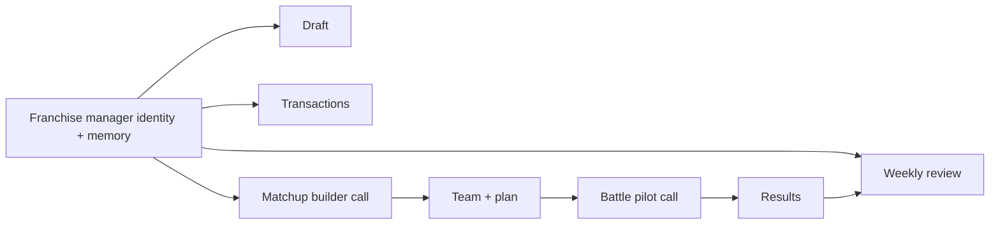

# Manager model

A franchise has one model-facing manager identity for the season. The manager drafts the roster, reviews completed weeks, chooses transactions, and owns the private memory carried between those stages.

The matchup builder and battle pilot are separate provider calls made on the manager's behalf. The builder receives the current roster, opponent, format rules, prior manager memory, and authorized earlier results. It returns one legal registered team and plan. The pilot receives that team, the visible battle state, the plan and notebook, and legal action candidates. It returns battle choices and may update only the series notebook.

Weekly review is the barrier that turns completed builds, games, and reflections into revised franchise memory. A post-transaction reconciliation performs the same job when the roster changes. Memory is private to its franchise; public review reasoning is released only when its week or transaction window is released.

`runDraftLeague` remains the software orchestrator. It sequences stages, passes state, persists completion, and carries user cancellation. There is no manager registry, delegate scheduler, autonomous manager process, or agent that schedules other agents. The manager is a role presented to model calls, not a software subsystem.
