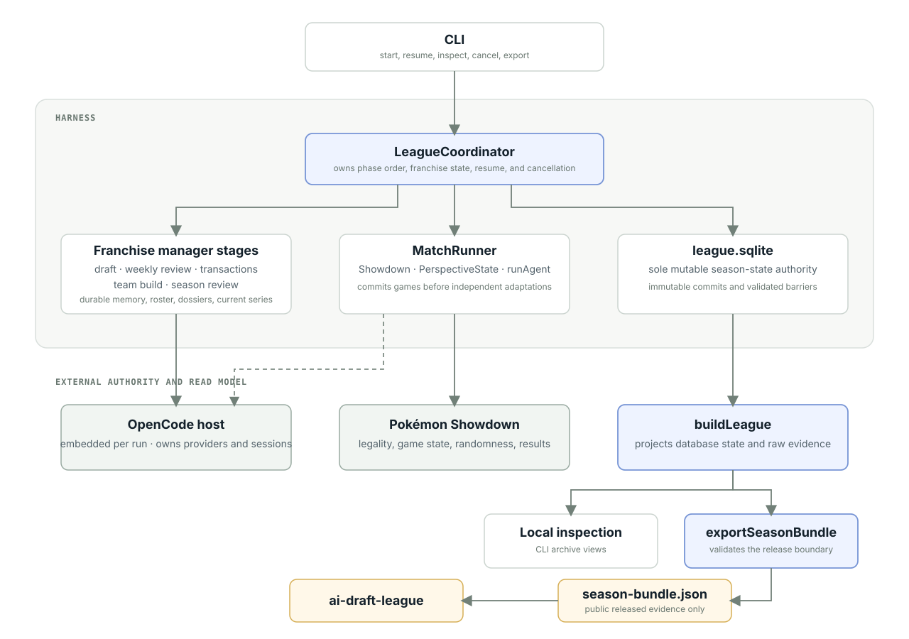

# Understand the harness architecture

The harness separates season orchestration, model calls, battle simulation, persistence, and publication. Each boundary has one authority.

<figure class="doc-diagram">
  
  <figcaption>The run directory connects execution, local inspection, and public export. Model providers and Pokémon Showdown remain external.</figcaption>
</figure>

See [Franchise manager state](manager-model.md) for the context supplied to model calls.

## Orchestrate and persist a run

`runDraftLeague` owns phase order and carries one cancellation signal through the run. Stage functions consume explicit state and return draft, review, transaction, team, battle, or season-review results.

The run directory is the database. `config.json` records models and seating, seed, board and format, Showdown revision, concurrency, timer and sheet policy, schedule, transactions, and provider specifications.

Decisions, game evidence, and completion records are append-only. Completion markers define resume boundaries. Resume replays complete records in order and continues from the last valid marker.

## Resolve battles

`playRecordedSeries` runs a best-of-three against the pinned simulator. Pokémon Showdown decides team legality, accepted actions, randomness, battle transitions, timers, and results. League code enforces draft ownership, budgets, roster size, and Mega Evolution locks.

`showdown.lock.json` names the full official commit. Setup verifies the installation before a run starts.

## Read and publish data

`league-store` reads saved state for resume. `buildLeague` joins completed run files and series records for local inspection and export. The spectator app's development server can read run directories through `/watch`; public pages read only exported bundles.

`exportSeasonBundle` is the only publication path. It requires an explicit release boundary, validates the projection, and writes `season-bundle.json`. Every planned series in a released week must be complete and have verified replay evidence. Each boundary step past the regular season adds one playoff round; a boundary containing the final also releases season reviews and opens closed sheets.

The bundle includes released rosters, builds, standings, games, decisions, transactions, reviews available at that boundary, and the bracket. It excludes notebooks, memory pages, prompts, provider responses, traces, credentials, and future results.

## Enforce trust boundaries

- Setup verifies the Showdown pin before execution
- Provider keys remain in process memory and never enter run files or public bundles
- Run and series identifiers are validated before filesystem access
- User cancellation aborts the run; provider adapters own infrastructure retries, timeouts, and error classification
- The optional Showdown timer owns gameplay deadlines
