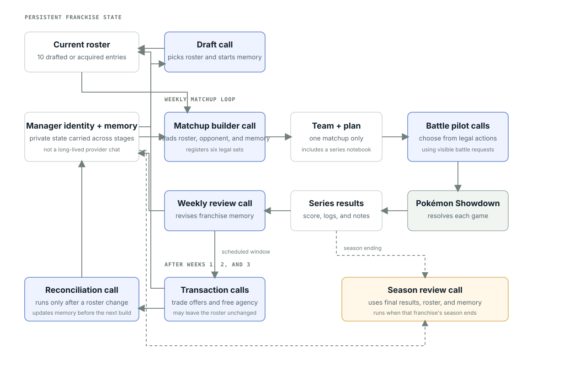

# Understand franchise manager state

A franchise keeps one manager identity and one private memory throughout the season. Stages that ask a model submit separate tasks for that manager to the run's OpenCode host.

<figure class="doc-diagram">
  
  <figcaption>Blue boxes are stage tasks on the run's OpenCode host. White boxes are saved state. Tasks communicate only through state supplied by the harness.</figcaption>
</figure>

## Build and play a matchup

The matchup builder receives the current roster, opponent roster, format, private memory, and schedule-authorized earlier results. It returns one legal team of 6 and a plan.

The battle pilot receives that team, visible battle state, the plan, its private memory, and legal actions. It submits battle choices and may replace three strategic memory fields: a team playbook that survives the series, series memory about the current opponent, and a next-game plan. Both opponent fields clear when a tournament entrant advances. Over-budget replacements are rejected rather than clipped. Battle memory cannot change season memory or the roster, but the final notebook may enter later playoff context.

The build artifact stores the complete franchise-memory snapshot used by its builder. The pilot receives that read-only snapshot alongside the team plan and set notes, even if later reviews change franchise memory. Pilot conversations continue throughout each game and its review; a new game starts with the notebook carried forward. OpenCode handles compaction. `read_battle_history` retrieves private game evidence beyond the current conversation. Reflections can update individual notebook fields or keep them unchanged. Weekly review tools page longer series logs rather than discard their endings.

Pokémon Showdown resolves each game. Completed results feed the next scheduled weekly review, which can update franchise memory.

## Change a roster

A transaction window follows the weekly review after configured weeks. Managers can offer trades, make free-agent swaps, or keep the roster. A changed roster triggers reconciliation before the next build. See [Transactions](trade-window.md).

## Close a season

When a franchise finishes, its season review receives final results, roster, and memory. The retrospective records evidence but changes no season state.

## Keep orchestration outside the manager

`runDraftLeague` sequences stages, supplies state, persists completion, and carries cancellation. A manager is a role presented to model calls, not an autonomous process or agent scheduler.
